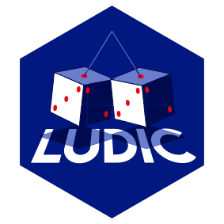

<!-- README.md is generated from README.Rmd. Please edit that file -->

# `ludic` <a></a>

<!-- badges: start -->

[](https://cran.r-project.org/package=ludic)
[](https://github.com/borishejblum/ludic/actions/workflows/R-CMD-check.yaml)
[](https://app.codecov.io/gh/borishejblum/ludic)
[](https://www.r-pkg.org/pkg/ludic)
<!-- badges: end -->

## Overview

`ludic` is a package which implements **Probabilistic Record Linkage**
methods that rely on the use of diagnosis codes only, in the absence of
direct identifiers. On top of the [CRAN help
files](https://cran.r-project.org/package=ludic) and the function
`recordLink()`, the following article explains what `ludic` is about:

> Hejblum BP, Weber G, Liao KP, Palmer N, Churchill S, Szolovits P,
> Murphy S, Kohane I, Cai T (2019). Probabilistic Record Linkage of
> De-Identified Research Datasets Using Diagnosis Codes. *Scientific
> Data*, **6**:180298. [\<doi:
> 10.1038/sdata.2018.298\>](https://doi.org/10.1038/sdata.2018.298).

`ludic` also implements an automated testing framework avoiding to
select a given threshold for claiming a match in function `atlas()`.

> Zhang HG, Hejblum BP, Weber G, Palmer N, Churchill S, Szolovits P,
> Murphy S, Liao KP, Kohane I and Cai T (2021). ATLAS: An automated
> association test using probabilistically linked health records with
> application to genetic studies. *JAMIA*, 28(12):2582-2592. [\<doi:
> 10.1093/jamia/ocab187\>](https://doi.org/10.1093/jamia/ocab187).

## Installation

The easiest way to get `ludic` is to install it from
[CRAN](https://cran.r-project.org/package=ludic):

``` r
install.packages("ludic")
```

or alternatively you can get the development version from
[GitHub](https://github.com/borishejblum/ludic):

``` r
#install.packages("devtools")
devtools::install_github("borishejblum/ludic")
```

– Boris Hejblum
